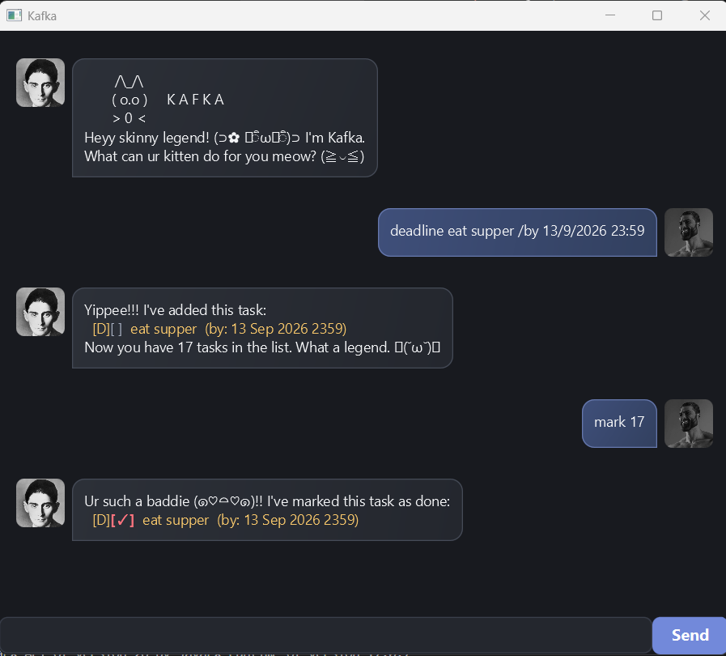

# Kafka User Guide

Heyy skinny legend! I'm Kafka. What can ur kitten do for you meow? (≧◡≦)

Got deadlines, errands, and a suspiciously long list of things you'll do "later"? Let me do the remembering for u!
I'm a desktop task manager: you type commands into our chat, and I keep your todos, deadlines,
and events together. You bring the hustle. I'll be your secretary and emotional support >////<



*That's us, king. Your commands go in the box at the bottom; my replies appear in the chat.*

## In this guide

- [Quick start](#quick-start)
- [Features](#features)
- [Dates and times](#dates-and-times)
- [Saving your tasks](#saving-your-tasks)
- [FAQ](#faq)
- [Known limitations and troubleshooting](#known-limitations-and-troubleshooting)
- [Command summary](#command-summary)

## Quick start

1. Install **Java 25**. Run `java -version` in a terminal to check you're using version 25.
2. Get the Kafka JAR from the project's [releases page](https://github.com/Kafka03/ip/releases).
3. Put `kafka.jar` in a folder you won't forget (preferably in the center of your desktop)
4. Open a terminal in that folder and run:

   ```text
   java -jar kafka.jar
   ```

5. Once our chat opens, type a command in the bottom box and press **Enter** or click **Send**.
   Try these one at a time:

   ```text
   todo drink water
   deadline submit assignment /by 2026-09-20 2359
   event study sesh /from 2026-09-19 1400 /to 2026-09-19 1600
   list
   ```

6. On a fresh list, `mark 1` completes "drink water". Type `bye` when you're ready to leave.

Yippee!!! You're officially managing things. What a legend. ᕦ(˘ω˘)ᕤ

If there isn't a JAR asset available, follow the [project setup instructions](https://github.com/Kafka03/ip#readme)
to run from source with Java 25. To make the JAR, run `./gradlew shadowJar`
(`.\gradlew.bat shadowJar` on Windows); it appears at `build/libs/kafka.jar`.

## Features

### Before you type, alpha

- Words in `UPPER_CASE` are placeholders. Replace `DESCRIPTION` with your actual task.
- Command words and markers are **case-sensitive**: use `todo` and `/by`, not `TODO` and `/BY`.
- Keep each command on one line. Task descriptions and schedule values cannot contain a pipe (`|`).
- Put spaces around markers: `/by Sunday`, not `/bySunday`. Use each required marker only once.
- `TASK_NUMBER` means a positive whole number shown by `list` or `find`, such as `1` or `3`.
  It must refer to an existing task.
- `list` and `bye` must appear alone. Extra arguments aren't ignored, sowwy.
- In syntax examples, square brackets mean an optional part. Don't type those brackets.

### Adding a todo: `todo`

Something to do, no date attached. Hydration counts, king.

**Format:** `todo DESCRIPTION`

**Example:** `todo drink water`

I'll add an unfinished todo at the end of your list and tell you the new task count:

```text
Yippee!!! I've added this task:
  [T][ ]  drink water
Now you have 1 task in the list. What a legend. ᕦ(˘ω˘)ᕤ
```

That count assumes you started with an empty list. A description is required.

### Adding a deadline: `deadline`

Has anyone watched Redline it's a great movie! (✿ヘᴥヘ)

**Format:** `deadline DESCRIPTION /by WHEN`

**Example:** `deadline submit assignment /by 2026-09-20 2359`

I'll add an unfinished deadline, display its due value as `20 Sep 2026 2359`, and show your task count.
Both the description and the value after `/by` are required.

You can also type `deadline return book /by Sunday`. See [Dates and times](#dates-and-times)
for what I can format and what stays as text.

### Adding an event: `event`

Study sesh? Supper? Put it on the list, queen.

**Format:** `event DESCRIPTION /from START /to END`

**Example:** `event study sesh /from 2026-09-19 1400 /to 2026-09-19 1600`

I'll add an unfinished event with the start and end you supplied.
The description, start, and end are all required. `/from` must come before `/to`.

### Seeing everything: `list`

**Format:** `list`

I'll show all your tasks in the order you added them, including completed tasks.
An empty list gets: "You have no tasks lined up king >0<".

| Marker | Meaning |
| --- | --- |
| `[T]` | Todo: no schedule attached |
| `[D]` | Deadline: has a due value |
| `[E]` | Event: has a start and end |
| `[ ]` | Not done yet |
| `[✓]` in the GUI, `[X]` in the console | Done. Ur such a baddie |

The number before each task is the number to use when editing it.
**After deleting a task, run `list` again:** later tasks move up and their numbers change.

### Finding a task: `find`

Lost something while hustling? I'll work hard to find it for you!

**Format:** `find KEYWORD`

**Examples:**

- `find book` matches `book`, `Book`, and `textbook`.
- `find study sesh` looks for that entire phrase, including the space.
- `find Sep` can match a displayed September date.

Search ignores letter case and looks for your text anywhere in the **displayed task**,
including the description, type/status markers, and schedule. Multiple words are one search phrase,
not separate alternatives. If nothing matches, the matching-tasks reply contains no task rows.

**Results keep their original list numbers.** If the only match is `3`, use `mark 3`, not `mark 1`.
Searching doesn't change or renumber your list.

### Finishing a task: `mark`

**Format:** `mark TASK_NUMBER`

**Example:** `mark 1`

I'll mark task 1 as done and show its updated checkbox. It stays in the list so you can admire your work.
Marking an already completed task leaves it completed.

Ur such a baddie (๑♡⌓♡๑)!!

### Taking that back: `unmark`

**Format:** `unmark TASK_NUMBER`

**Example:** `unmark 1`

I'll make task 1 unfinished again. Its checkbox becomes `[ ]`.
Unmarking an unfinished task leaves it unfinished. Awww issok my g, we go again.

### Renaming a task: `rename`

**Format:** `rename TASK_NUMBER NEW_DESCRIPTION`

**Example:** `rename 1 drink two glasses of water`

I'll show the old task and its new name. The task number, type, completion status, and schedule stay the same.
Give me a nonempty replacement description, pwease.

### Changing a schedule: `snooze`

Plans changed? Gotcha. We can move things around ღ(U ω Uღ).

For a deadline:

**Format:** `snooze TASK_NUMBER /by NEW_WHEN`

**Example:** `snooze 2 /by 2026-09-21 2359`

For an event, change its start, its end, or both:

**Format:** `snooze TASK_NUMBER [/from NEW_START] [/to NEW_END]`

**Examples:**

- `snooze 3 /from 2026-09-19 1500` changes only the start.
- `snooze 3 /to 2026-09-19 1700` changes only the end.
- `snooze 3 /from 2026-09-20 1400 /to 2026-09-20 1600` changes both.

These examples assume task 2 is a deadline and task 3 is an event, as in the fresh quick-start list.

I'll show the schedule before and after the change. Your task's name and completion status stay the same.
For events, supply at least one marker; if you supply both, put `/from` before `/to`.
Use `/by` only for deadlines and `/from` or `/to` only for events. Each supplied value must be nonempty.

A todo can't be snoozed because it has no date or time to change, sowwy.
You can move a schedule earlier or later; `snooze` replaces the value and doesn't set an alarm.

### Yeeting a task: `delete`

**Format:** `delete TASK_NUMBER`

**Example:** `delete 1`

I'll remove task 1 and show the removed task and remaining count. Later tasks move up one number.

**There's no confirmation prompt or undo command.** Check the number with `list` first, king.
If you only finished the task, use `mark` to keep it in your list.

### Saying goodbye: `bye`

**Format:** `bye`

I'll say goodbye and close the app. Your successfully saved tasks will be there next time.
Bye babe~ Hope we bump into each other soon!

## Dates and times

Give me one of these formats and I'll tidy it up for display:

| Input kind | Examples | Display |
| --- | --- | --- |
| Date | `2026-09-20`, `20/9/2026`, `20 Sep 2026` | `20 Sep 2026` |
| Time | `1400`, `14:00`, `2:00pm`, `2pm` | `1400` |
| Date and time, separated by a space | `20/9/2026 2pm` | `20 Sep 2026 1400` |

Month abbreviations and AM/PM are case-insensitive. You can combine any supported date format
with any supported time format, separated by a space.

Free-form values such as `Sunday` or `after class` are stored as text. They aren't converted into a calendar date.
Unrecognized or impossible values can also remain as text; the GUI highlights detected invalid date/time
tokens, such as `31/2/2026` or `25:00`, in red. Use `snooze` to correct them.

I don't check that an event ends after it starts, and I don't send deadline notifications.
Pwease check your schedule yourself too, alpha.

## Saving your tasks

I automatically save after every successful addition, deletion, mark, unmark, rename, or snooze.
No save command needed. If saving fails, the attempted change isn't applied. Try fixing the problem and then retry it.

Your tasks live in **`data/kafka.txt`, relative to the folder you launched Kafka from**.
If you followed the quick start, that's the folder containing your JAR.
Always launch from the same folder to load the same list.

To back up your tasks, close Kafka and copy `data/kafka.txt` somewhere safe.
To restore a backup, close Kafka and replace that file with your saved copy.
Keep a copy of the existing file first if you might need its tasks later.

Please use commands to edit tasks. Editing the save file by hand can make it unreadable, and then we both get sad.

## FAQ

**How do I move my tasks to another computer?**

Close Kafka, copy your JAR and `data/kafka.txt` to the new computer, keeping the same folder arrangement,
and launch with Java 25 from the folder containing the JAR. That's us reunited, blood brother.

**Where did my tasks go?**

Check the folder you launched from. A different launch folder means a different `data/kafka.txt`.
A missing save file starts an empty list. Return to the original launch folder to load your existing tasks.

**Can I ask you things in normal sentences?**

I need the commands in this guide, meow. `help`, `clear`, `undo`, and `exit` aren't supported commands;
use the command summary below, and `bye` to leave.

**Can I keep two Kafka windows open?**

Only one running instance can use the same task file at a time. Close the existing instance before opening another. Sowwy (U ﹏ U)

## Known limitations and troubleshooting

Sowwy if we hit a bump. Here's how to get back to hustling.

| What happened | What to do |
| --- | --- |
| I don't recognize the command | Check lowercase spelling and spaces. Use `list` or `bye` without extra words. |
| I ask for a description or time | Supply every required value and the correct `/by`, `/from`, or `/to` markers. |
| I can't find that task number | Run `list` and use a current positive whole number. Search results retain those same numbers. |
| A date or time is red | Check for an impossible value and correct it with `snooze`. Free-form text isn't fully validated. |
| I can't save tasks | Check the reported file location, folder write permissions, and disk space; retry after fixing the cause. |
| Saved tasks could not be loaded | In a recovery prompt, choose **No** to preserve the file, then close Kafka and inspect it or restore a backup. **Yes** replaces the corrupted file with an empty list; choose it only if you accept losing those saved tasks. |
| Kafka says another instance is running | Close the Kafka instance using the same task file, then try again. |
| Some faces show up as boxes | Your system font may lack those characters. Commands still work, even if my face is having a moment. |

## Command summary

For when you know what you're doing and just need the words, night city legend.

| Action | Format | Example |
| --- | --- | --- |
| Add todo | `todo DESCRIPTION` | `todo drink water` |
| Add deadline | `deadline DESCRIPTION /by WHEN` | `deadline return book /by Sunday` |
| Add event | `event DESCRIPTION /from START /to END` | `event study sesh /from 2pm /to 4pm` |
| List tasks | `list` | `list` |
| Find tasks | `find KEYWORD` | `find book` |
| Mark done | `mark TASK_NUMBER` | `mark 1` |
| Mark unfinished | `unmark TASK_NUMBER` | `unmark 1` |
| Rename | `rename TASK_NUMBER NEW_DESCRIPTION` | `rename 1 drink water` |
| Reschedule deadline | `snooze TASK_NUMBER /by NEW_WHEN` | `snooze 2 /by Monday` |
| Reschedule event | `snooze TASK_NUMBER [/from NEW_START] [/to NEW_END]` | `snooze 3 /to 5pm` |
| Delete | `delete TASK_NUMBER` | `delete 1` |
| Exit | `bye` | `bye` |

*Guide structure inspired by the [AddressBook Level 3 User Guide](https://se-education.org/addressbook-level3/UserGuide.html#features).
Site theme: [Architect](https://github.com/pages-themes/architect). All that meowing? That's me.*
